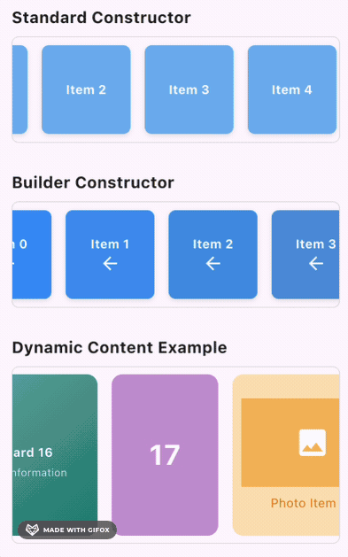

# AutoScrollRow

[](https://github.com/TheBSD/StandWithPalestine/blob/main/docs/README.md) [](https://pub.dev/packages/auto_scroll_row)

AutoScrollRow is a Flutter widget that allows automatic scrolling of a row of widgets `horizontally` with customizable options. It is useful for creating marquees or content sliders with smooth animation control.

## Features

- Automatically scrolls a row of widgets horizontally.
- Customizable scrolling speed (`scrollDuration`).
- Option to reverse scroll direction (`reverse`).
- User interaction control (`enableUserScroll`): allow users to stop scrolling by dragging.
- Memory-efficient builder constructor for large lists or dynamic content.



## Getting started

To use this package, add **`auto_scroll_row`** to your `pubspec.yaml`:

```yaml
dependencies:
  auto_scroll_row: ^x.x.x
```

Run the following command:

```bash
flutter pub get
```

## Usage

### Standard Constructor

Here's a basic example of how to use the `AutoScrollRow` widget in your Flutter app:

```dart
AutoScrollRow(
 children: List.generate(
   10,
   (index) => Container(
     width: 100,
     height: 100,
     margin: const EdgeInsets.all(8),
     color: Colors.blueAccent,
     child: Center(child: Text('Item $index')),
   ),
 ),
 scrollDuration: const Duration(minutes: 15),  // Customize scroll speed
 reverse: false,  // Set to true for right-to-left scroll
 enableUserScroll: true,  // Enable user to stop scroll by dragging
),
```

### Builder Constructor

For improved performance with many items or dynamic content, use the `builder` constructor which only renders visible items:

```dart
AutoScrollRow.builder(
  itemCount: 100,  // Specify the total number of items
  itemBuilder: (context, index) => Container(
    width: 100,
    height: 100,
    margin: const EdgeInsets.all(8),
    color: Colors.blue[(index * 100) % 900],
    child: Center(child: Text('Item $index')),
  ),
  scrollDuration: const Duration(minutes: 10),  // Customize scroll speed
  reverse: true,  // Set to true for right-to-left scroll
  enableUserScroll: true,  // Enable user to stop scroll by dragging
),
```

## Additional information

### Standard Constructor Parameters

- **`children`**: List of widgets displayed in the horizontal row.
- **`scrollDuration`**: Controls the speed of scrolling. Default is 30 minutes for a full cycle. Customize to make scrolling faster or slower.
- **`reverse`**: Set to `true` for right-to-left scrolling.
- **`enableUserScroll`**: Enable or disable user control over scrolling. Set to `true` to allow users to stop the scroll by dragging.

### Builder Constructor Parameters

- **`itemBuilder`**: Function that builds widgets on demand as they become visible. Takes a BuildContext and index.
- **`itemCount`**: Total number of items in the list.
- **`scrollDuration`**: Controls the speed of scrolling. Default is 30 minutes for a full cycle.
- **`reverse`**: Set to `true` for right-to-left scrolling.
- **`enableUserScroll`**: Enable or disable user control over scrolling.

### User Interaction

When `enableUserScroll` is set to `true`:

- Users can grab and scroll the content manually
- Auto-scrolling stops when the user starts dragging
- When the user releases, auto-scrolling continues from the current position

## Support

If you find this plugin helpful, consider supporting me:

[](https://buymeacoffee.com/is10vmust)
